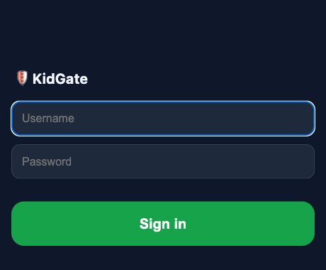
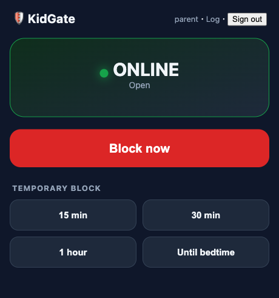
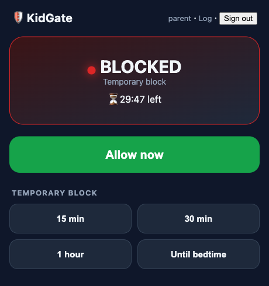
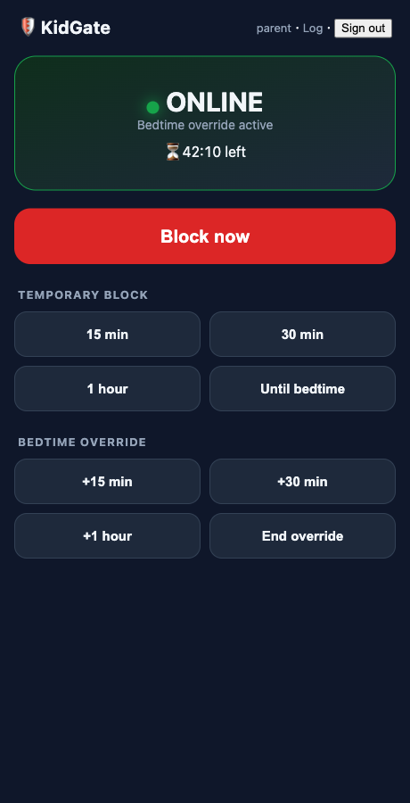

# 🛡️ KidGate

LAN-only web portal to block/allow the kids' internet on the home UniFi network,
override the bedtime schedule, and see live status — from a phone, one tap.

Controls **pre-built UniFi Policy Engine policies** by toggling their `enabled`
flag. It never creates/deletes firewall rules at runtime (PRD §4.2).

## Screenshots

Installable PWA — dark, one-tap, phone-first.

| Sign in | Online | Temporary block |
|:---:|:---:|:---:|
|  |  |  |

The status card turns green when the kids are online and red when blocked, with a
live countdown for temporary blocks and bedtime overrides:



## Validated environment

| | |
|---|---|
| Hardware | UniFi Dream Machine SE |
| UniFi OS | 5.1.15 |
| Network app | 10.4.57 |
| Control API | `object-oriented-network-config` (Network 10 Policy Engine) |

See `SPIKE-FINDINGS.md` for the proven REST contract. If a firmware update breaks
things, **`app/unifi.py` is the only file to fix** (PRD §4.1).

## How it works

Two UniFi policies (already created in the UniFi UI, mapped in `.env`):

- **Kids Ad-Hoc Block** — schedule *Always*, normally disabled. KidGate toggles this for
  "Block now" / "Allow now" / temporary blocks.
- **Kids Nightime** — schedule *11:30 PM–6:00 AM*. KidGate disables it for a grace window
  to grant a bedtime override, then re-enables it.

Effective state: `blocked = adhoc_on OR (bedtime_on AND within 23:30–06:00)`.
Precedence: **manual block > override > schedule** (PRD §8).

Timers (temp-block / override expiry) are real APScheduler jobs persisted in SQLite,
so they **survive a container restart**; a reconcile pass runs on boot.

## Setup

### 1. UniFi prerequisites (one-time, in the UniFi UI)
- A **Kids client group** containing the kids' devices.
- The two policies above, targeting that group. Map their IDs into `.env`
  (`ADHOC_BLOCK_POLICY_ID`, `SCHEDULED_BLOCK_POLICY_ID`).
- A **local-only UniFi admin** (Settings → Admins, accessed via the console's **local IP**,
  *not* unifi.ui.com — check **"Restrict to Local Access Only"**). Role: Network = Site Admin.
  This avoids the mandatory cloud MFA. Put its creds in `.env` (`UNIFI_USERNAME/PASSWORD`).

### 2. Configure
```bash
cp .env.example .env   # then edit: UniFi creds, policy IDs, APP_USERS, TIMEZONE, ntfy
```
Key vars: `UNIFI_*`, `ADHOC_BLOCK_POLICY_ID`, `SCHEDULED_BLOCK_POLICY_ID`,
`APP_USERS` (portal logins, e.g. `david:pw:admin,wife:pw:user`), `SECRET_KEY`,
`NTFY_TOPIC` (optional notifications).

### 3. Run

**Docker (deployment):**
```bash
docker compose up -d --build
```
Then open `http://<homelab-lan-ip>:8099` and **Add to Home Screen** (installable PWA).

**Local (dev):**
```bash
python -m venv .venv && ./.venv/bin/pip install -r requirements.txt
./.venv/bin/python -m uvicorn app.main:app --host 0.0.0.0 --port 8099
```

## Notifications (ntfy)
Set `NTFY_TOPIC` (and `NTFY_SERVER`/`NTFY_TOKEN` for self-hosted/protected). Subscribe to the
topic in the ntfy phone app to get pushes when a block starts/ends or an override is granted.
Leave `NTFY_TOPIC` blank to disable.

## Security notes
- LAN-only by design — do **not** expose port 8099 publicly. Remote access should go via Tailscale (out of scope, PRD §6).
- UniFi credentials live server-side only; the browser only ever sees the portal session cookie.
- `.env` and `data/` are gitignored. Don't commit secrets.

## Project layout
```
app/
  config.py    settings (.env)
  unifi.py     UnifiProvider — the single UniFi adapter (firmware-break isolation)
  service.py   state machine + persistent scheduler (precedence, timers, reconcile)
  db.py        SQLite: users, audit log, timers
  auth.py      local users (PBKDF2), session cookie
  notify.py    Notifier seam + ntfy
  main.py      FastAPI routes + lifespan wiring
  templates/   login, dashboard, audit (Jinja2)
  static/      PWA: styles, app.js, service worker, manifest, icon
spike/         throwaway UniFi validation script (how the contract was proven)
```
